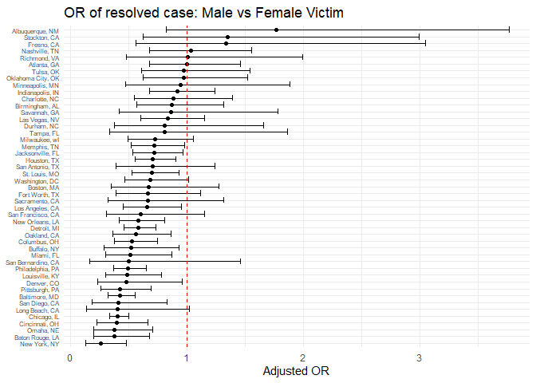
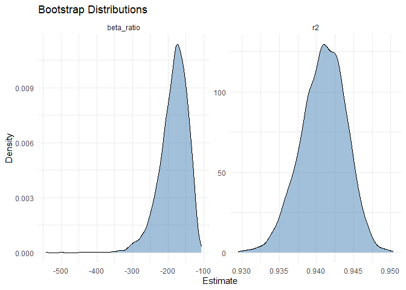
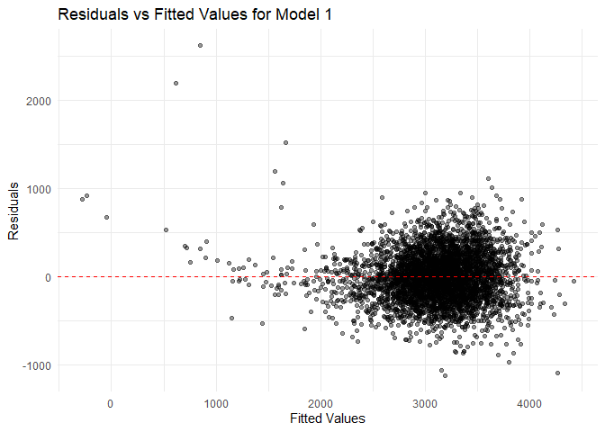
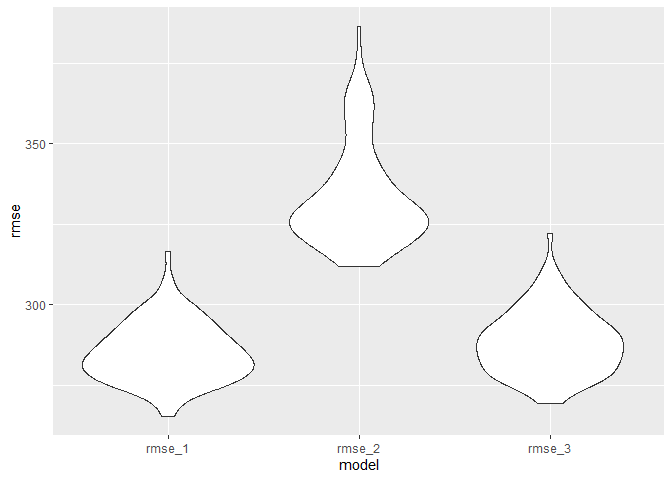

p8105_hw6_sx2402
================
Eric Xu
2025-11-28

## Problem 1

### 1. Import and prepare data

``` r
homicide_raw = read_csv(
  "https://raw.githubusercontent.com/washingtonpost/data-homicides/master/homicide-data.csv"
)

homicide_df = homicide_raw |>
  janitor::clean_names() |>
  mutate(
    city_state = str_c(city, ", ", state),
    resolved = if_else(disposition == "Closed by arrest", 1, 0),
    resolved = as.numeric(resolved),
    victim_age = case_when(victim_age == "Unknown" ~ NA, .default = victim_age),
    victim_age = as.numeric(victim_age),
    victim_race = fct_relevel(victim_race, "White")
  ) |>
  filter(
    !city_state %in% c("Dallas, TX", "Phoenix, AZ", "Kansas City, MO", "Tulsa, AL"),
    victim_race %in% c("White", "Black")
  ) |>
  mutate(
    victim_sex = fct_relevel(victim_sex, "Female"),
    victim_race = fct_relevel(victim_race, "White")
  )
```

Fit logistic regression on Baltimore data.

``` r
baltimore_df = homicide_df |>
  filter(city_state == "Baltimore, MD")

baltimore_fit = 
  baltimore_df |> 
  glm(resolved ~ victim_age + victim_race + victim_sex, data = _, family = binomial()) 


baltimore_results = baltimore_fit |>
  tidy(conf.int = TRUE, exponentiate = TRUE) |>
  filter(term == "victim_sexMale") |> mutate(adjusted_OR = estimate)|> 
  select(adjusted_OR, estimate, conf.low, conf.high)

kable(baltimore_results)
```

| adjusted_OR |  estimate |  conf.low | conf.high |
|------------:|----------:|----------:|----------:|
|   0.4255117 | 0.4255117 | 0.3241908 | 0.5575508 |

Fit for city in one pipeline

``` r
city_results = homicide_df |>
  group_by(city_state) |>
  nest() |>
  mutate(
    model = map(
      data, 
      ~ glm(
          resolved ~ victim_age + victim_race + victim_sex,
          data = .x,
          family = binomial()
        )
    )
    ) |> 
  mutate(
    tidy = map(
      model,
      ~ tidy(.x, conf.int = TRUE, exponentiate = TRUE)
    )
  ) |> 
  unnest(tidy) |> 
  filter(term == "victim_sexMale") |>
    mutate(
    adjusted_OR = estimate
  ) |> 
  select(
    city_state,
    adjusted_OR,
    conf.low, 
    conf.high
  )
kable(city_results)
```

| city_state         | adjusted_OR |  conf.low | conf.high |
|:-------------------|------------:|----------:|----------:|
| Albuquerque, NM    |   1.7674995 | 0.8247081 | 3.7618600 |
| Atlanta, GA        |   1.0000771 | 0.6803477 | 1.4582575 |
| Baltimore, MD      |   0.4255117 | 0.3241908 | 0.5575508 |
| Baton Rouge, LA    |   0.3814393 | 0.2043481 | 0.6836343 |
| Birmingham, AL     |   0.8700153 | 0.5713814 | 1.3138409 |
| Boston, MA         |   0.6739912 | 0.3534469 | 1.2768225 |
| Buffalo, NY        |   0.5205704 | 0.2884416 | 0.9358300 |
| Charlotte, NC      |   0.8838976 | 0.5507440 | 1.3905954 |
| Chicago, IL        |   0.4100982 | 0.3361233 | 0.5008546 |
| Cincinnati, OH     |   0.3998277 | 0.2313767 | 0.6670456 |
| Columbus, OH       |   0.5324845 | 0.3770457 | 0.7479124 |
| Denver, CO         |   0.4790620 | 0.2327380 | 0.9624974 |
| Detroit, MI        |   0.5823472 | 0.4619454 | 0.7335458 |
| Durham, NC         |   0.8123514 | 0.3824420 | 1.6580169 |
| Fort Worth, TX     |   0.6689803 | 0.3935128 | 1.1211603 |
| Fresno, CA         |   1.3351647 | 0.5672553 | 3.0475080 |
| Houston, TX        |   0.7110264 | 0.5569844 | 0.9057376 |
| Indianapolis, IN   |   0.9187284 | 0.6784616 | 1.2413059 |
| Jacksonville, FL   |   0.7198144 | 0.5359236 | 0.9650986 |
| Las Vegas, NV      |   0.8373078 | 0.6058830 | 1.1510854 |
| Long Beach, CA     |   0.4102163 | 0.1427304 | 1.0241775 |
| Los Angeles, CA    |   0.6618816 | 0.4565014 | 0.9541036 |
| Louisville, KY     |   0.4905546 | 0.3014879 | 0.7836391 |
| Memphis, TN        |   0.7232194 | 0.5261210 | 0.9835973 |
| Miami, FL          |   0.5152379 | 0.3040214 | 0.8734480 |
| Milwaukee, wI      |   0.7271327 | 0.4951325 | 1.0542297 |
| Minneapolis, MN    |   0.9469587 | 0.4759016 | 1.8809745 |
| Nashville, TN      |   1.0342379 | 0.6807452 | 1.5559966 |
| New Orleans, LA    |   0.5849373 | 0.4218807 | 0.8121787 |
| New York, NY       |   0.2623978 | 0.1327512 | 0.4850117 |
| Oakland, CA        |   0.5630819 | 0.3637421 | 0.8671086 |
| Oklahoma City, OK  |   0.9740747 | 0.6228507 | 1.5199721 |
| Omaha, NE          |   0.3824861 | 0.1988357 | 0.7109316 |
| Philadelphia, PA   |   0.4962756 | 0.3760120 | 0.6498797 |
| Pittsburgh, PA     |   0.4307528 | 0.2626022 | 0.6955518 |
| Richmond, VA       |   1.0060520 | 0.4834671 | 1.9936248 |
| San Antonio, TX    |   0.7046200 | 0.3928179 | 1.2382509 |
| Sacramento, CA     |   0.6688418 | 0.3262733 | 1.3143888 |
| Savannah, GA       |   0.8669817 | 0.4185827 | 1.7802453 |
| San Bernardino, CA |   0.5003444 | 0.1655367 | 1.4623977 |
| San Diego, CA      |   0.4130248 | 0.1913527 | 0.8301847 |
| San Francisco, CA  |   0.6075362 | 0.3116925 | 1.1551470 |
| St. Louis, MO      |   0.7031665 | 0.5298505 | 0.9319005 |
| Stockton, CA       |   1.3517273 | 0.6256427 | 2.9941299 |
| Tampa, FL          |   0.8077029 | 0.3395253 | 1.8598834 |
| Tulsa, OK          |   0.9757694 | 0.6090664 | 1.5439356 |
| Washington, DC     |   0.6901713 | 0.4653608 | 1.0122516 |

Plotting the adjusted odds ratios.

``` r
city_plot = city_results |> 
  ggplot(aes(x = adjusted_OR, y = fct_reorder(city_state, adjusted_OR)))+
  geom_point() +
  geom_errorbar(aes(xmin = conf.low, xmax = conf.high)) +
  geom_vline(xintercept = 1, linetype = "dashed", color = "red") +
  labs(
    title = "OR of resolved case: Male vs Female Victim",
    x = "Adjusted OR",
    y = NULL
  ) +
  theme_minimal()+
  theme(
    axis.text.y = element_text(size = 6)
  )
city_plot
```

<!-- -->

Comment: A half of the cities have a wide confidence interval including
the null value. This suggests not enough evidence of male victims having
higher odds of resolved cases compared to female after adjusting for
race and age. Other cities showing a significance usually have a odds
ratio smaller than 1. This shows that in these cities, it is
statistically significant that male victims have lower odds of resolved
cases compared to female after adjusting for race and age. The lower OR
estimates are more stable with lower SE and narrow CI.

## Problem 2

``` r
data("weather_df")

boot_df = weather_df |>
  drop_na(tmax, tmin, prcp) |> 
  modelr::bootstrap(n = 5000) |>
  mutate(
    models = map(strap, \(df) lm(tmax ~ tmin + prcp, data = df) ),
    results = map(models, tidy),
    glance = map(models, glance)) |> 
  select(-strap, -models) |> 
  unnest(results, names_sep = "_") |>
  unnest(glance, names_sep = "_")

boot_results = boot_df |> group_by(.id,results_term) |> 
  mutate(
    r2 = glance_r.squared
  ) |> 
  select(results_term,results_estimate,r2,.id) |> 
    pivot_wider(
    names_from = results_term,
    values_from = results_estimate
  ) |>
  mutate(
    beta_ratio = tmin / prcp
  )

boot_plot = boot_results |>
  select(r2, beta_ratio,.id) |>
  pivot_longer(
    cols = c(r2, beta_ratio),
    names_to = "estimate",
    values_to = "value"
  )
boot_plot |> 
  ggplot(aes(x = value)) +
  geom_density(fill = "steelblue", alpha = 0.5) +
  facet_wrap(vars(estimate),scales = "free") +
  theme_minimal() +
  labs(
    title = "Bootstrap Distributions",
    x = "Estimate",
    y = "Density"
  )
```

<!-- -->

Both r squared and beta quotient in plot are slightly left skewed
distribution. While it is unimodal and approximately symmetric, this
suggests that the bootstrap procedure is stable and that the statistics
behave regularly under repeated sampling.

``` r
boot_ci = boot_plot |>
  group_by(estimate) |> 
  summarize(
    ci_lower = quantile(value, 0.025),
    ci_upper = quantile(value, 0.975)
  )
kable(boot_ci, digits = 3)
```

| estimate   | ci_lower | ci_upper |
|:-----------|---------:|---------:|
| beta_ratio | -278.661 | -124.766 |
| r2         |    0.935 |    0.946 |

## Problem 3

``` r
birthweight_data = read.csv("birthweight.csv") |> 
  janitor::clean_names() |>
  mutate(
    babysex = factor(babysex, labels = c("Male", "Female")),
    frace = factor(frace,
                   levels = c(1,2,3,4,8,9),
                   labels = c("White","Black","Asian","Puerto Rican","Other","Unknown")),
    mrace = factor(mrace,
                   levels = c(1,2,3,4,8),
                   labels = c("White","Black","Asian","Puerto Rican","Other")),
    malform = factor(malform, labels = c("Absent","Present"))
    ) |> drop_na()
```

Now use a data-driven model-building process that models the birth
weight from the fetal growth perspective that including the fetal status
only.

``` r
model1 = birthweight_data |> lm(
bwt ~ bhead + blength + gaweeks + babysex,data = _)

summary(model1)
```

    ## 
    ## Call:
    ## lm(formula = bwt ~ bhead + blength + gaweeks + babysex, data = birthweight_data)
    ## 
    ## Residuals:
    ##      Min       1Q   Median       3Q      Max 
    ## -1120.93  -190.49   -12.36   177.87  2613.29 
    ## 
    ## Coefficients:
    ##                Estimate Std. Error t value Pr(>|t|)    
    ## (Intercept)   -6264.154     97.900 -63.985  < 2e-16 ***
    ## bhead           140.867      3.566  39.508  < 2e-16 ***
    ## blength          81.756      2.081  39.287  < 2e-16 ***
    ## gaweeks          14.067      1.513   9.297  < 2e-16 ***
    ## babysexFemale    33.420      8.839   3.781 0.000158 ***
    ## ---
    ## Signif. codes:  0 '***' 0.001 '**' 0.01 '*' 0.05 '.' 0.1 ' ' 1
    ## 
    ## Residual standard error: 285.7 on 4337 degrees of freedom
    ## Multiple R-squared:  0.6891, Adjusted R-squared:  0.6888 
    ## F-statistic:  2403 on 4 and 4337 DF,  p-value: < 2.2e-16

``` r
birthweight_resid = birthweight_data |>
  add_predictions(model1) |>
  add_residuals(model1)

birthweight_resid |>
ggplot(aes(x = pred, y = resid)) +
geom_point(alpha = 0.4) +
geom_hline(yintercept = 0, linetype = "dashed", color = "red") +
theme_minimal() +
labs(
title = "Residuals vs Fitted Values for Model 1",
x = "Fitted Values",
y = "Residuals"
)
```

<!-- --> The residuals
are centered around zero with slight curvature with low fitted value.
Variability has no obvious change at higher fitted values, and seemingly
no major violations of linearity.

``` r
cv_df =
  crossv_mc(birthweight_data, 100) |>
  mutate(
    train = map(train, as_tibble),
    test  = map(test,  as_tibble),
    fit_1 = map(train, ~ lm(bwt ~ bhead + blength + gaweeks + babysex, data = .x)),
    fit_2 = map(train, ~ lm(bwt ~ blength + gaweeks, data = .x)),
    fit_3 = map(train, ~ lm(bwt ~ bhead * blength * babysex, data = .x)),
    rmse_1 = map2_dbl(fit_1, test, ~ rmse(model = .x, data = .y)),
    rmse_2 = map2_dbl(fit_2, test, ~ rmse(model = .x, data = .y)),
    rmse_3 = map2_dbl(fit_3, test, ~ rmse(model = .x, data = .y))
)


cv_results = cv_df |>
  select(starts_with("rmse")) |>
  pivot_longer(everything(),
               names_to = "model",
               values_to = "rmse")

cv_summary = cv_results |>
  group_by(model) |>
  summarize(
    mean_rmse = mean(rmse),
    sd_rmse   = sd(rmse)
    )

cv_results |> ggplot(aes(x = model, y = rmse)) + geom_violin()
```

<!-- -->

``` r
kable(cv_summary, digits = 3)
```

| model  | mean_rmse | sd_rmse |
|:-------|----------:|--------:|
| rmse_1 |   285.177 |   9.144 |
| rmse_2 |   333.366 |  15.786 |
| rmse_3 |   288.175 |  10.004 |

<!-- Model 1 have a relatively low RMSE distribution, compared to other model. However, model 1 does not account for interaction terms and has more estimators compared to model 2. Model 3 is more complex with full interaction terms but does not improve prediction and is seemingly over-fit. Overall, model 1 would be the better pick. -->
